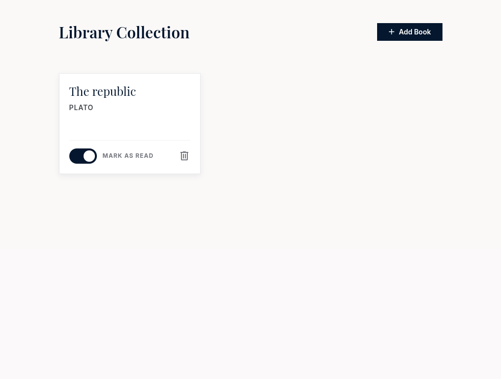

# Personal Library Manager

This is a solution to the
[Library project in the JavaScript course of The Odin Project](https://www.theodinproject.com/paths/full-stack-javascript/courses/javascript).

## Table of Contents

- [Overview](#overview)
    - [Screenshot](#screenshot)

## Overview

The solution features a Library Manager App with a responsive and accessible UI
and persistant storage functionality.

### Screenshot

